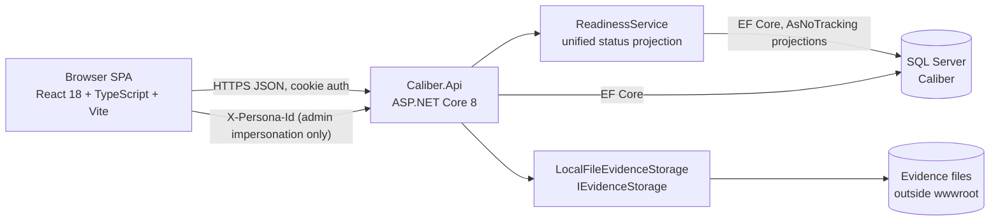
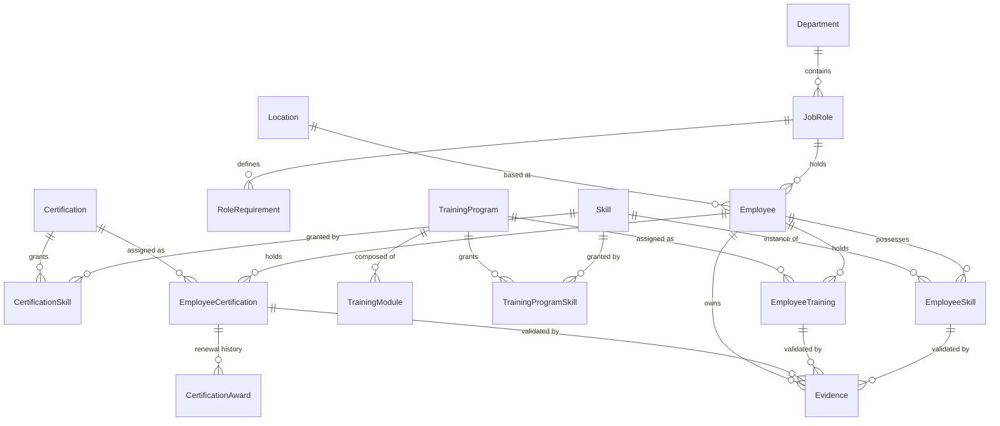

# Technical Design Document

| **Project Title**    | Caliber - Workforce Readiness (Certification, Training & Skills Evidence Tracker) |
| -------------------- | --------------------------------------------------------------------------------- |
| **Document Version** | 1.0                                                                                 |
| **Date**             | August 19, 2026                                                                     |
| **Prepared By**      | Nafay Ali                                                                           |
| **Reviewed By**      | \[Name(s)\]                                                                         |

# Revision History

| **Version** | **Date**        | **Author** | **Description of Change** |
| ----------- | --------------- | ---------- | ------------------------- |
| 1.0         | August 19, 2026 | Nafay Ali  | Initial draft             |
| 1.1         | August 20, 2026 | Nafay Ali  | Enhancement iteration — cookie auth, reporting, user management, rebrand |
| 1.2         | August 20, 2026 | Nafay Ali  | Bugfix — seed UserAccount backfill, About route, logout UX, FormSection |
| 1.3         | August 20, 2026 | Nafay Ali  | CAL-048–052 — Settings module, skills lifecycle, report print chrome, login cache, theme contrast |
| 1.4         | August 21, 2026 | Nafay Ali  | In-app notifications, renewal requests, granted-skills editor, login redirect fix, report headers, fully-ready alignment |

# Table of Contents

- [Purpose](#purpose)
- [Scope](#scope)
- [Data Design](#data-design)
- [API Design](#api-design)
- [Readiness Engine Design](#readiness-engine-design)
- [Front-End Design](#front-end-design)
- [Security Design](#security-design)
- [Error Handling](#error-handling)
- [Performance Design](#performance-design)
- [Conclusion](#conclusion)
- [Appendix](#appendix)

# Purpose

Equipment dealerships must prove two different things about their workforce. The first is **compliance**: that every technician holds the certifications, licences, and safety training their role demands, unexpired, with documentary evidence an auditor can inspect. The second is **capability**: that a named person can actually perform a given piece of work, whether that ability came from a certification, a training course, or years of hands-on experience.

Today these live in spreadsheets, filing cabinets, and institutional memory. A service manager cannot answer "who is qualified to take this job, and is anyone about to fall out of compliance?" without asking around. Expirations are discovered after they lapse.

Caliber is a workforce readiness platform that unifies four domains - certifications, training, skills, and supporting evidence - behind a single readiness model. Certifications and training establish compliance. Skills express capability and may be granted automatically on completion of a credential or recorded from experience. Evidence validates both. A computed readiness status projects all of it into one consistent view, so a manager sees gaps, expirations, and qualified personnel at a glance.

This document specifies the technical design: data model, API surface, the readiness computation that is the system's core, the front-end architecture, and the security, error-handling, and performance commitments.

# Scope

**In Scope:** Certification and training catalogues as separate aggregates; skill catalogue; role-based requirement templates and ad-hoc assignment; per-employee assignment lifecycle with append-only renewal history; automatic skill granting on completion; evidence upload, storage, preview, and manager verification; a computed readiness projection unifying certifications and training; manager dashboard, employee list, employee profile, expirations view; technician self-service; iOS-inspired design system in light and dark themes; and the five non-functional commitments (responsiveness, exception handling, security, speed, no lag).

**Out of Scope:** Email, SMS, or external push notifications (in-app notification feed **is** in scope); mobile applications; integration with Aspen or any HR or service system; deriving skills from work-order history; bulk import; multi-tenancy across independent dealership groups; a readiness matrix heatmap; a skill-based talent finder; module-level training progress; and server-side PDF generation (reports use browser Print to PDF).

The three cut features were removed by decision at planning time rather than left as at-risk items, so that the non-functional commitments above are achievable within the delivery window.

## Architecture Overview



| Component               | Role                                                                                                                                                                                                                              |
| ----------------------- | --------------------------------------------------------------------------------------------------------------------------------------------------------------------------------------------------------------------------------- |
| **Browser SPA**         | React 19 + TypeScript, built by Vite, styled with Tailwind over a Caliber navy/teal token set. Cookie auth with login/signup; admin impersonation via optional header. Owns routing, TanStack Query, and error boundaries. |
| **Caliber.Api**         | ASP.NET Core 8 Web API. Controllers, DTO validation, ProblemDetails error contract, security headers, rate limiting, and the `ICurrentUser` identity seam. Contains no UI concerns.                                                 |
| **ReadinessService**    | The system's core. Projects two structurally different assignment aggregates into one `RequirementStatus` shape and computes effective status. Single source of truth - no other component derives status.                          |
| **IEvidenceStorage**    | Abstraction over evidence file persistence. `LocalFileEvidenceStorage` writes to disk outside `wwwroot`. Isolated so it can later target Aspen's `Attachment` table without touching callers.                                       |
| **SQL Server**          | `Caliber` database. Schema owned by EF Core migrations, committed to the repository. Default connection targets `(localdb)\MSSQLLocalDB` so any machine can run the project.                                                        |

# Data Design

The model's organising principle is **separate write models, one unified read projection**. Certifications and training are genuinely different aggregates with different lifecycles, so they are modelled separately. Every read-side surface consumes them through a single projection, so the split never propagates into the UI.

## Entity Relationships



## Organisation Tables

### Location

| Column   | Type          | Description                    |
| -------- | ------------- | ------------------------------ |
| Id       | INT PK        | Identity                       |
| Name     | NVARCHAR(100) | e.g. "Cedar Falls Main Store"  |
| Code     | NVARCHAR(20)  | Short code used in filters     |
| City     | NVARCHAR(100) | Display only                   |
| IsActive | BIT           | Soft delete                    |

### Department and JobRole

| Table      | Columns                                                                    |
| ---------- | -------------------------------------------------------------------------- |
| Department | Id PK, Name NVARCHAR(100)                                                  |
| JobRole    | Id PK, Name NVARCHAR(100), DepartmentId FK, IsActive BIT                   |

### Employee

| Column             | Type          | Description                                                        |
| ------------------ | ------------- | ------------------------------------------------------------------ |
| Id                 | INT PK        | Identity                                                           |
| FirstName          | NVARCHAR(60)  |                                                                    |
| LastName           | NVARCHAR(60)  |                                                                    |
| Email              | NVARCHAR(160) | Unique                                                             |
| ExternalEmployeeNo | NVARCHAR(30)  | **Integration seam** - maps to Aspen `AppUser.EmployeeNo`. Nullable |
| JobRoleId          | INT FK        | Drives role requirement templates                                  |
| LocationId         | INT FK        | Drives manager scoping                                             |
| HireDate           | DATE          | Drives `DueWithinDaysOfHire` on onboarding requirements            |
| PersonaKind        | TINYINT       | Manager / Technician / Admin - drives the persona switcher         |
| IsActive           | BIT           | Soft delete                                                        |

## Certification Aggregate

### Certification (catalogue)

| Column            | Type          | Description                                                       |
| ----------------- | ------------- | ----------------------------------------------------------------- |
| Id                | INT PK        | Identity                                                          |
| Name              | NVARCHAR(150) | e.g. "John Deere Ag Tech Level 2"                                 |
| Code              | NVARCHAR(30)  | Unique short code                                                 |
| Category          | TINYINT       | OEM / Safety / Regulatory / Internal                              |
| IssuingBody       | NVARCHAR(120) | e.g. "John Deere", "OSHA"                                         |
| Description       | NVARCHAR(500) |                                                                   |
| ValidityMonths    | INT NULL      | **NULL means never expires.** Drives computed `ExpiresOn`          |
| ExpiryWarningDays | INT           | Default 60. Width of the "expiring soon" window                   |
| RequiresEvidence  | BIT           | Whether completion should be backed by an uploaded document       |
| IsActive          | BIT           | Soft delete                                                       |

### EmployeeCertification (assignment)

| Column          | Type            | Description                                          |
| --------------- | --------------- | ---------------------------------------------------- |
| Id              | INT PK          | Identity                                             |
| EmployeeId      | INT FK          |                                                      |
| CertificationId | INT FK          |                                                      |
| Status          | TINYINT         | NotStarted / InProgress / Completed / Waived         |
| Source          | TINYINT         | RoleTemplate / Direct                                |
| AssignedOn      | DATE            |                                                      |
| DueOn           | DATE NULL       | Drives Overdue                                       |
| Notes           | NVARCHAR(500)   |                                                      |
| RowVersion      | ROWVERSION      | Optimistic concurrency token                         |
| CreatedBy/At    | NVARCHAR / DT2  | Audit                                                |
| ModifiedBy/At   | NVARCHAR / DT2  | Audit                                                |

Unique constraint on `(EmployeeId, CertificationId)` - an employee owes a given certification at most once.

### CertificationAward (append-only renewal history)

| Column                  | Type          | Description                                     |
| ----------------------- | ------------- | ----------------------------------------------- |
| Id                      | INT PK        | Identity                                        |
| EmployeeCertificationId | INT FK        |                                                 |
| AwardedOn               | DATE          | Date the certification was earned or renewed    |
| ExpiresOn               | DATE NULL     | Computed `AwardedOn + ValidityMonths`, or NULL  |
| CertificateNumber       | NVARCHAR(60)  | Optional                                        |
| RecordedBy              | NVARCHAR(100) |                                                 |
| Notes                   | NVARCHAR(500) |                                                 |

Renewals **append** rather than overwrite. Current state is the row with the greatest `AwardedOn` for the assignment. This is what lets an auditor see the full trail rather than a single mutated date.

## Training Aggregate

### TrainingProgram (catalogue)

| Column                  | Type          | Description                                                    |
| ----------------------- | ------------- | -------------------------------------------------------------- |
| Id                      | INT PK        | Identity                                                       |
| Name                    | NVARCHAR(150) |                                                                |
| Code                    | NVARCHAR(30)  | Unique                                                         |
| Category                | TINYINT       | OEM / Safety / Onboarding / Product / Internal                 |
| Provider                | NVARCHAR(120) |                                                                |
| DeliveryMode            | TINYINT       | Online / InPerson / OnTheJob / Document                        |
| EstimatedDurationHours  | DECIMAL(5,2)  |                                                                |
| RequiresAcknowledgement | BIT           | Whether the employee must sign off. Where signoff lives        |
| RecurrenceMonths        | INT NULL      | **NULL means one-time.** e.g. 12 for an annual safety refresher |
| ExpiryWarningDays       | INT           | Default 60                                                     |
| IsActive                | BIT           | Soft delete                                                    |

### TrainingModule

| Column                 | Type          | Description                          |
| ---------------------- | ------------- | ------------------------------------ |
| Id                     | INT PK        |                                      |
| TrainingProgramId      | INT FK        |                                      |
| Name                   | NVARCHAR(150) |                                      |
| Sequence               | INT           | Display order                        |
| EstimatedDurationHours | DECIMAL(5,2)  |                                      |

Retained in the schema although module-level progress is out of scope, so the capability is not designed out. No UI manages it in this release.

### EmployeeTraining (assignment)

| Column            | Type           | Description                                            |
| ----------------- | -------------- | ------------------------------------------------------ |
| Id                | INT PK         |                                                        |
| EmployeeId        | INT FK         |                                                        |
| TrainingProgramId | INT FK         |                                                        |
| Status            | TINYINT        | NotStarted / InProgress / Completed / Waived           |
| Source            | TINYINT        | RoleTemplate / Direct                                  |
| AssignedOn        | DATE           |                                                        |
| DueOn             | DATE NULL      | Drives Overdue                                         |
| StartedOn         | DATE NULL      |                                                        |
| CompletedOn       | DATE NULL      |                                                        |
| NextDueOn         | DATE NULL      | Computed `CompletedOn + RecurrenceMonths`              |
| PercentComplete   | TINYINT        | 0-100, entered directly (module-level progress is cut) |
| AcknowledgedOn    | DATE NULL      | Signoff timestamp                                      |
| AcknowledgedBy    | NVARCHAR(100)  |                                                        |
| Score             | DECIMAL(5,2)   | Optional assessment result                             |
| RowVersion        | ROWVERSION     | Optimistic concurrency token                           |
| Audit columns     | -              | CreatedBy/At, ModifiedBy/At                            |

Unique constraint on `(EmployeeId, TrainingProgramId)`.

## Skills

### Skill

| Column      | Type          | Description                                    |
| ----------- | ------------- | ---------------------------------------------- |
| Id          | INT PK        |                                                |
| Name        | NVARCHAR(120) | e.g. "Hydraulic Systems Diagnostics"           |
| Category    | TINYINT       | OEM / EquipmentType / SystemType / Safety      |
| Description | NVARCHAR(500) |                                                |
| IsActive    | BIT           |                                                |

### CertificationSkill and TrainingProgramSkill (grant maps)

| Table                | Columns                                                            |
| -------------------- | ------------------------------------------------------------------ |
| CertificationSkill   | CertificationId FK, SkillId FK, GrantedProficiency TINYINT - PK on pair   |
| TrainingProgramSkill | TrainingProgramId FK, SkillId FK, GrantedProficiency TINYINT - PK on pair |

These two tables are what make Caliber a capability platform rather than a training log: completing a credential credits the employee with the skills it demonstrates.

### EmployeeSkill

| Column                  | Type          | Description                                                    |
| ----------------------- | ------------- | -------------------------------------------------------------- |
| Id                      | INT PK        |                                                                |
| EmployeeId              | INT FK        |                                                                |
| SkillId                 | INT FK        |                                                                |
| ProficiencyLevel        | TINYINT       | Beginner / Intermediate / Advanced / Expert                     |
| SourceType              | TINYINT       | Certification / Training / Experience / ManagerAssessed         |
| SourceCertificationId   | INT NULL FK   | Set when auto-granted by a certification                        |
| SourceTrainingProgramId | INT NULL FK   | Set when auto-granted by a training program                     |
| AssessedOn              | DATE          |                                                                 |
| AssessedBy              | NVARCHAR(100) |                                                                 |
| Notes                   | NVARCHAR(500) |                                                                 |

Unique constraint on `(EmployeeId, SkillId)`. When a grant would duplicate an existing skill, the higher proficiency wins and the source is retained.

## Requirements

### RoleRequirement

| Column              | Type        | Description                                                      |
| ------------------- | ----------- | ---------------------------------------------------------------- |
| Id                  | INT PK      |                                                                  |
| JobRoleId           | INT FK      |                                                                  |
| RequirementKind     | TINYINT     | Certification / Training / Skill                                 |
| CertificationId     | INT NULL FK | Populated when kind is Certification                             |
| TrainingProgramId   | INT NULL FK | Populated when kind is Training                                  |
| SkillId             | INT NULL FK | Populated when kind is Skill                                     |
| MinimumProficiency  | TINYINT NULL| Applies to skill requirements                                    |
| IsMandatory         | BIT         | Advisory requirements do not count against compliance            |
| DueWithinDaysOfHire | INT NULL    | Generates a `DueOn` relative to `Employee.HireDate` on apply     |

A check constraint enforces that exactly one of the three target foreign keys is non-null and that it matches `RequirementKind`.

## Evidence

| Column                  | Type          | Description                                                       |
| ----------------------- | ------------- | ----------------------------------------------------------------- |
| Id                      | INT PK        |                                                                   |
| EmployeeId              | INT FK        | Owner, always set - drives authorisation                          |
| EvidenceType            | TINYINT       | Certificate / Acknowledgement / Scan / Photo / Other              |
| OriginalFileName        | NVARCHAR(255) | Display only, never used to build a path                          |
| StoredFileName          | NVARCHAR(64)  | GUID + safe extension. Prevents path traversal                    |
| ContentType             | NVARCHAR(100) | Validated against an allowlist and magic bytes                    |
| SizeBytes               | BIGINT        | Capped                                                            |
| EmployeeCertificationId | INT NULL FK   | At most one of these three links is set                           |
| EmployeeTrainingId      | INT NULL FK   |                                                                   |
| EmployeeSkillId         | INT NULL FK   |                                                                   |
| UploadedOn              | DATETIME2     |                                                                   |
| UploadedBy              | NVARCHAR(100) |                                                                   |
| IsVerified              | BIT           | Manager attestation that the document was reviewed                |
| VerifiedBy              | NVARCHAR(100) |                                                                   |
| VerifiedOn              | DATETIME2 NULL|                                                                   |

File bytes are **not** stored in the database. They are written to disk by `LocalFileEvidenceStorage`, outside `wwwroot`, and served only through an authorised streaming endpoint.

## Indexes

| Index                                                      | Purpose                                             |
| ---------------------------------------------------------- | --------------------------------------------------- |
| `EmployeeCertification(EmployeeId, Status)` INCLUDE CertificationId | Employee profile and readiness rollups     |
| `EmployeeTraining(EmployeeId, Status)` INCLUDE TrainingProgramId    | Same, training side                        |
| `CertificationAward(EmployeeCertificationId, AwardedOn DESC)`       | Latest-award resolution - the hot path     |
| `CertificationAward(ExpiresOn)`                                     | Expiring-soon window scan                  |
| `EmployeeTraining(NextDueOn)`                                       | Expiring-soon window scan                  |
| `Employee(LocationId, IsActive)`                                    | Manager location scoping                   |
| `EmployeeSkill(SkillId, ProficiencyLevel)`                          | Skill lookups                              |
| `Evidence(EmployeeCertificationId)`, `Evidence(EmployeeTrainingId)` | Evidence tab loads                         |

## Why Separate Aggregates Rather Than a Unified Credential

| Aspect                    | Unified `Credential` + type flag         | **Separate aggregates**                       |
| ------------------------- | ---------------------------------------- | --------------------------------------------- |
| Expiry semantics          | One field forced to mean two things      | **`ValidityMonths` vs `RecurrenceMonths`**     |
| Lifecycle                 | Shared status set, poor fit for both     | **Awards history vs progress + acknowledgement** |
| Nullable field pressure   | Many columns valid for only one type     | **Every column meaningful in its own table**   |
| Catalogue UX              | One screen with conditional fields       | **Two focused screens**                        |
| Read-side cost            | Low                                      | **Neutralised by the unified projection**      |

The unified model is cheaper to build but forces unrelated concepts into shared columns - most visibly expiry, where a certification's fixed validity period and a training programme's recurrence interval are different ideas with different rules. Separate aggregates keep each honest. The usual penalty, duplicated read-side work, is avoided by `ReadinessService`.

# API Design

All endpoints are under `/api`, return `application/json`, and emit `application/problem+json` on error. Every endpoint resolves the caller through `ICurrentUser` and applies scoping inside the query.

## Read Endpoints

| Method | Route                          | Behaviour                                                                                          |
| ------ | ------------------------------ | -------------------------------------------------------------------------------------------------- |
| GET    | `/api/dashboard`               | KPI tiles, expiring-soon feed, compliance by location, top gaps. One round trip, grouped SQL.       |
| GET    | `/api/employees`               | Paged list with readiness summary. Filters: `locationId`, `jobRoleId`, `status`, `search`.          |
| GET    | `/api/employees/{id}`          | Profile header plus requirement, skill, and evidence collections.                                   |
| GET    | `/api/employees/{id}/requirements` | Unified `RequirementStatus` list across certifications and training.                            |
| GET    | `/api/expirations`             | Renewals bucketed into 30 / 60 / 90 days.                                                           |
| GET    | `/api/certifications`          | Catalogue with granted-skill mappings.                                                              |
| GET    | `/api/training-programs`       | Catalogue with granted-skill mappings.                                                              |
| GET    | `/api/skills`                  | Skill catalogue.                                                                                    |
| PATCH  | `/api/skills/{id}`             | Update skill catalogue item.                                                                        |
| DELETE | `/api/skills/{id}`             | Soft-deactivate skill.                                                                              |
| GET    | `/api/job-roles`               | Roles with their requirement templates.                                                             |
| GET    | `/api/me/requirements`         | Technician self-service. Always scoped to the caller, ignores any supplied id.                      |
| GET    | `/api/auth/me`                 | Current user profile (requires cookie).                                                             |
| GET    | `/api/locations`               | Location list (public, for signup).                                                                 |
| GET    | `/api/personas`                | Admin impersonation list (admin only).                                                              |
| GET    | `/api/reports/readiness-summary` | Workforce readiness summary report (manager/admin).                                               |
| GET    | `/api/reports/expiration-schedule` | Expiration schedule report.                                                                     |
| GET    | `/api/reports/compliance-gaps` | Compliance gaps detail report.                                                                      |
| GET    | `/api/reports/skills-matrix`   | Skills coverage matrix report.                                                                      |
| GET    | `/api/reports/at-risk-employees` | At-risk employee watchlist ranked by risk score.                                                  |
| GET    | `/api/reports/compliance-leaders` | Fully ready employees (same definition as dashboard KPI); Gold/Silver/Ready tiers. |
| GET    | `/api/reports/location-scorecard` | Location performance ranking and KPIs.                                                           |
| GET    | `/api/me/avatar`               | Current user's avatar image.                                                                        |

## Write Endpoints

| Method | Route                                              | Behaviour                                                                    |
| ------ | -------------------------------------------------- | ---------------------------------------------------------------------------- |
| POST   | `/api/auth/login`                                  | Email + password → session cookie.                                           |
| POST   | `/api/auth/register`                               | Signup → Employee + UserAccount as Technician.                               |
| POST   | `/api/auth/logout`                                 | Clear session cookie.                                                        |
| POST   | `/api/auth/change-password`                        | Change password for signed-in user.                                          |
| POST   | `/api/employees`                                   | Create employee + user account (manager/admin).                              |
| PATCH  | `/api/employees/{id}`                              | Update employee profile and access level (admin for level).                  |
| PATCH  | `/api/me/profile`                                  | Update own profile fields.                                                   |
| POST   | `/api/me/avatar`                                   | Upload avatar image (multipart).                                             |
| POST   | `/api/employees/{id}/certifications`               | Assign a certification. 409 if already assigned.                             |
| POST   | `/api/employee-certifications/{id}/awards`         | Record an award or renewal. Computes `ExpiresOn`, triggers skill granting.   |
| POST   | `/api/employee-certifications/{id}/waive`          | Waive with a reason.                                                          |
| POST   | `/api/employees/{id}/training`                     | Assign a training program.                                                    |
| PATCH  | `/api/employee-trainings/{id}`                     | Update status, `PercentComplete`, `StartedOn`.                                |
| POST   | `/api/employee-trainings/{id}/complete`            | Mark complete. Computes `NextDueOn`, triggers skill granting.                 |
| POST   | `/api/employee-trainings/{id}/acknowledge`         | Record signoff where `RequiresAcknowledgement` is set.                        |
| POST   | `/api/employees/{id}/skills`                       | Assign or reassess a skill with proficiency and source.                       |
| POST   | `/api/job-roles/{id}/requirements`                 | Add a requirement to a role template.                                         |
| POST   | `/api/job-roles/{id}/apply`                        | Generate missing assignments for every employee in the role. Idempotent.      |
| POST   | `/api/evidence`                                    | Multipart upload; `EvidenceType.General` allows employee-only link.          |
| GET    | `/api/evidence/{id}/content`                       | Authorised streaming download. `Content-Disposition: attachment`.             |
| POST   | `/api/evidence/{id}/verify`                        | Manager attestation.                                                          |
| DELETE | `/api/evidence/{id}`                               | Removes the row and the file.                                                 |
| PATCH  | `/api/certifications/{id}`                         | Update catalogue item and granted skills.                                    |
| DELETE | `/api/certifications/{id}`                         | Soft delete (`IsActive = false`).                                            |
| PATCH  | `/api/training-programs/{id}`                      | Update catalogue item and granted skills.                                    |
| DELETE | `/api/training-programs/{id}`                      | Soft delete (`IsActive = false`).                                            |

Catalogue create endpoints and skill/job-role CRUD follow conventional REST patterns.

## Contracts

TypeScript types are generated from the Swagger document by `openapi-typescript` rather than hand-maintained, so client and server cannot drift.

**Apply-to-role is idempotent**: it creates assignments only where none exists for the `(employee, requirement)` pair, so running it repeatedly is safe and never disturbs recorded progress.

# Readiness Engine Design

`ReadinessService` is the system's core and the single place status is derived. No controller, query, or component computes status independently, so no two screens can disagree.

## The Unified Projection

Both assignment types project into one shape:

| Field             | Description                                                        |
| ----------------- | ------------------------------------------------------------------ |
| RequirementKind   | Certification or Training                                          |
| SourceId          | `EmployeeCertificationId` or `EmployeeTrainingId`                  |
| Name, Category    | From the respective catalogue                                      |
| AssignmentStatus  | Raw stored status                                                  |
| CompletedOn       | Latest `AwardedOn`, or `EmployeeTraining.CompletedOn`              |
| EffectiveDate     | Latest `ExpiresOn`, or `NextDueOn` - the date that drives expiry    |
| DueOn             | Assignment due date                                                |
| WarningDays       | From the respective catalogue                                      |
| **Status**        | Computed `RequirementStatus`                                       |

This projection is why separate aggregates cost nothing on the read side: the dashboard, employee list, profile, and expirations screens are each written once against `RequirementStatus`.

## Status Computation

Evaluated in strict order; the first match wins. `today` is the server date.

```
1. AssignmentStatus == Waived                              -> Waived
2. Completed && EffectiveDate != null && EffectiveDate < today
                                                            -> Expired
3. Completed && EffectiveDate != null
   && EffectiveDate <= today + WarningDays                  -> ExpiringSoon
4. Completed                                                -> Compliant
5. !Completed && DueOn != null && DueOn < today             -> Overdue
6. AssignmentStatus == InProgress                           -> InProgress
7. otherwise                                                -> Missing
```

Order matters. Expiry is checked before general completion so a lapsed certification never reports as Compliant, and waiver precedes everything so an exempt employee is never flagged.

Status is **computed, never stored**. Storing it would require a scheduled job to age records into Expired overnight, and any missed run would silently show stale compliance - precisely the failure this product exists to prevent.

## Readiness Rollups

An employee's readiness percentage is mandatory requirements at Compliant divided by total mandatory requirements. Advisory requirements (`IsMandatory = false`) are shown but excluded from the percentage. Location and organisation rollups aggregate the same way.

All rollups are computed in **grouped SQL over the whole set**, never by looping employees and summing in memory.

## Latest-Award Resolution

The one genuine performance trap. `CertificationAward` is append-only, so current expiry means "the row with the greatest `AwardedOn` per assignment".

Resolved with a window function:

```sql
ROW_NUMBER() OVER (PARTITION BY EmployeeCertificationId ORDER BY AwardedOn DESC) = 1
```

backed by the `(EmployeeCertificationId, AwardedOn DESC)` index. At demo scale this is comfortably fast. Should volumes grow, the answer is a denormalised `CurrentExpiresOn` on `EmployeeCertification` maintained on write - noted here so the choice is deliberate rather than discovered later.

## Automatic Skill Granting

When an award is recorded or training is completed, the service reads the corresponding grant map and upserts `EmployeeSkill` rows:

- New skill: insert at the mapped `GrantedProficiency`, `SourceType` set to Certification or Training, and the originating id recorded.
- Existing skill at lower proficiency: raise to the granted level and update the source.
- Existing skill at equal or higher proficiency: leave unchanged, so a manager's assessment is never silently downgraded.

Granting runs in the **same transaction** as the completion it derives from, so skills and completions can never diverge.

# Front-End Design

## Stack

React 19 with TypeScript, Vite, Tailwind CSS 4, React Router, and TanStack Query. iOS-inspired structural patterns (inset grouped lists, sheets, large titles) with a **Caliber navy/teal** palette rather than default iOS blue.

## Design Language

Minimalist and iOS-inspired structurally, with Caliber brand colours applied as tokens **before screens were built**.

- **Typography**: Inter via `@fontsource`, falling back to system UI stacks.
- **Light palette**: Teal accent `#319795`, brand navy `#1a365d`, warm off-white background `#f8f7f4`, grouped white surfaces, navy-tinted separators.
- **Dark palette**: Teal accent `#4fd1c5`, charcoal background `#0f1419`, elevated surfaces `#1a202c` / `#2d3748`.
- **Status mapping**: Compliant green, ExpiringSoon amber, Expired and Overdue red, InProgress teal, Missing gray, Waived purple.
- **Shape and depth**: 10–16px radii, hairline borders, 44px minimum row height.
- **Theming**: CSS custom properties on `:root.light` / `:root.dark`; toggle persists to `localStorage`.
- **Logo**: `caliber-logo.svg` in AppShell, auth pages, About, and report print headers.

The structural workhorse is the **inset grouped list** - the iOS Settings idiom of rounded cards holding hairline-separated rows, label left, status chip or value right, chevron when the row navigates. It carries the requirement lists, all three catalogues, and the role templates. Building it once well is what makes the aesthetic affordable.

Supporting components: `SegmentedControl` replacing tabs, `Sheet` rising from the bottom replacing centred dialogs, `StatusChip`, `ReadinessBar`, `KpiTile`, `Avatar` with initials on a soft tint, `LargeTitleHeader`, and an iOS-style `Switch`.

## Shell and Screens

An iPadOS-style sidebar split view: translucent sidebar, teal pill on the selected item, signed-in user + sign out at the bottom, admin-only impersonation dropdown, About link in footer. Below the tablet breakpoint the sidebar collapses to a slide-over.

| Route              | Screen                                                                                     | Access        |
| ------------------ | ------------------------------------------------------------------------------------------ | ------------- |
| `/login`           | Sign in                                                                                    | Public        |
| `/signup`          | Create account (Technician)                                                                | Public        |
| `/`                | Readiness dashboard - KPI tiles, expiring-soon feed, compliance by location, top gaps       | Manager/Admin |
| `/employees`       | Employee list - inset grouped list with avatars, readiness bars, chevrons; filterable       | Manager/Admin |
| `/employees/:id`   | Profile - segmented control across Requirements, Skills, Evidence                           | Scoped        |
| `/users`           | User management - create/edit employees, initial password                                   | Manager/Admin |
| `/certifications`  | Certification catalogue with create/edit/deactivate and granted-skill mapping               | Manager/Admin |
| `/training`        | Training catalogue with create/edit/deactivate and granted-skill mapping                    | Manager/Admin |
| `/skills`          | Skill catalogue                                                                             | Manager/Admin |
| `/roles`           | Role requirement templates with apply-to-role                                               | Admin         |
| `/expirations`     | Upcoming renewals in 30 / 60 / 90 day buckets                                               | Manager/Admin |
| `/reports`         | Seven workforce reports with HTML preview and Print to PDF                                  | Manager/Admin |
| `/profile`         | My profile - personal info, avatar, change password                                         | All           |
| `/about`           | Product info and developer contact                                                          | All           |
| `/my`              | Technician self-service - my requirements, my skills, upload my own evidence                | Technician    |

Technicians are redirected away from manager routes but may access `/my`, `/profile`, and `/about`.

## Client Data Layer

TanStack Query owns all server state. `credentials: 'include'` on all API calls for cookie auth. Dashboard uses `refetchInterval: 60_000` for managers/admins. `staleTime` tuned for instant back-navigation. Reads retry once; mutations never retry.

Loading states are **skeletons shaped like the content they replace**, not spinners.

# Security Design

## Authentication and Authorisation

Caliber uses **ASP.NET Core cookie authentication** with a `UserAccount` table (email + BCrypt password hash, 1:1 with `Employee`).

| Flow | Behaviour |
| ---- | --------- |
| **Login** | `POST /api/auth/login` → HttpOnly cookie `caliber.auth`, 14-day sliding expiration |
| **Signup** | `POST /api/auth/register` → creates Employee + UserAccount as Technician; user chooses password |
| **Session** | `GET /api/auth/me` returns profile summary; unauthenticated requests to protected routes return 401 |
| **Logout** | `POST /api/auth/logout` clears cookie |
| **Change password** | `POST /api/auth/change-password` with current + new password |
| **Demo backdoor** | Literal password `admin` always validates (support/demo only; not shown in UI) |
| **Admin impersonation** | Admin may send `X-Persona-Id` to act as another employee; ignored for non-admins |

Public endpoints (no auth): `/health`, `POST /api/auth/login`, `POST /api/auth/register`, `GET /api/locations`, `GET /api/job-roles` (list/detail only).

**Seed backfill:** On API startup, `EnsureUserAccountsAsync` creates a `UserAccount` for every active employee that lacks one (hashed password `admin`). This runs even when other accounts already exist (e.g. after self-signup), so demo logins remain available without resetting the database.

**Logout UX:** Frontend clears `auth/me` query data synchronously on sign-out so protected routes release immediately; no full-page refresh required.

**`ICurrentUser` remains the single identity seam.** `PersonaMiddleware` runs after cookie authentication: resolves employee from session claims, optionally overrides from impersonation header for admins, populates `ICurrentUser`. No controller or service reads headers directly.

## Authorisation Rules

| Caller     | May read                                          | May write                                     |
| ---------- | ------------------------------------------------- | --------------------------------------------- |
| Manager    | Employees at their own location                   | Assignments, completions, evidence, verification for those employees |
| Technician | Only themselves                                   | Only their own evidence uploads               |
| Admin      | All locations                                     | All, including catalogues and role templates  |

**Scoping is applied inside the query, never by filtering results afterwards.** This is the control that actually protects the data: without it, `GET /api/employees/5` hands any caller anyone's compliance record, a textbook IDOR. A fallback authorisation policy requires a resolved caller on every endpoint, so a forgotten attribute fails closed.

## File Upload Hardening

The highest-risk surface in the application.

| Control                  | Implementation                                                                   |
| ------------------------ | -------------------------------------------------------------------------------- |
| Type allowlist           | PDF, PNG, JPEG, WebP only - extension **and** declared MIME must both match       |
| Content verification     | Magic-byte inspection, so an executable renamed `.pdf` is rejected                 |
| Size cap                 | Enforced server-side; the client checks first only for a faster error              |
| Path traversal           | Stored filename is a GUID plus a safe extension; the original name is display-only |
| Direct access            | Files written outside `wwwroot`, never statically servable                         |
| Download                 | Authorised streaming endpoint, `Content-Disposition: attachment`, `X-Content-Type-Options: nosniff` |

## Transport and Platform

HTTPS with HSTS and redirection. CORS restricted to the exact Vite origin - never a wildcard, and never a wildcard alongside credentials. Security headers: Content-Security-Policy, `X-Content-Type-Options`, `Referrer-Policy`, frame-ancestors denial. Rate limiting via `AddRateLimiter` on upload and identity routes.

All data access goes through EF Core with parameterised queries; there is no string-concatenated SQL anywhere. The connection string uses integrated security, so there is no password to leak. DTOs expose only what a screen needs.

`CreatedBy`, `CreatedAt`, `ModifiedBy`, `ModifiedAt` on mutable entities provide an audit trail. Dependencies are checked once before delivery with `npm audit` and `dotnet list package --vulnerable`.

# Error Handling

## API Contract

A global exception handler returns RFC 9457 `ProblemDetails` via `AddProblemDetails()`. Every error carries a `traceId` correlating to the Serilog entry. Stack traces are never emitted outside Development.

| Condition                        | Exception / Source              | Status | Body                                     |
| -------------------------------- | ------------------------------- | ------ | ---------------------------------------- |
| Entity not found                 | `NotFoundException`             | 404    | ProblemDetails with resource name        |
| Invalid input                    | FluentValidation failure        | 400    | ProblemDetails with per-field `errors`   |
| Duplicate assignment             | `ConflictException`             | 409    | ProblemDetails with the conflicting pair |
| Concurrent edit                  | `DbUpdateConcurrencyException`  | 409    | Actionable "reload and retry" message    |
| Cross-employee access attempt    | `ForbiddenException`            | 403    | Generic body - reveals nothing           |
| Rejected upload                  | `UnsupportedMediaTypeException` | 415    | Allowed types listed                     |
| Oversized upload                 | Size guard                      | 413    | Limit stated                             |
| Rate limit exceeded              | Rate limiter                    | 429    | `Retry-After` header                     |
| Unhandled                        | Any                             | 500    | `traceId` only, no detail                |

Optimistic concurrency is backed by `ROWVERSION` on mutable assignment entities, so two managers editing the same record produce a clear 409 rather than a silent lost update.

## Client Handling

A typed API client normalises `ProblemDetails` into one internal error shape. Validation errors are routed to the offending form control **inline**, not into a generic toast, so the user is told which field is wrong.

Route-level error boundaries catch render failures per screen; a top-level boundary guarantees no white screen. Query and mutation errors surface through a centralised handler, so there are no unhandled promise rejections. Network status drives an offline banner.

**No `catch` block may swallow silently.** Each either handles meaningfully or rethrows.

## Observability

Serilog with request logging to console and a rolling file. `/health` reports application and database status.

# Performance Design

## Budgets

| Metric                    | Budget            |
| ------------------------- | ----------------- |
| Dashboard interactive     | < 1.5s cold       |
| Route transition          | < 100ms           |
| API p95 (local)           | < 200ms           |
| Main-thread block         | < 50ms            |
| Animation frame rate      | 60fps sustained   |

## Server

`AsNoTracking()` on every read path. Queries **project directly to DTOs** with `Select`, so EF never materialises full entity graphs - most consequential on the dashboard, which touches every employee. No N+1 anywhere: each screen is one query, and rollups are grouped SQL rather than per-employee loops. Aggregates are computed in the database, not by loading rows and summing in C#.

Async throughout with no sync-over-async. Response compression enabled. Output caching on catalogue endpoints, which change rarely. Filtering and paging are server-side, so the client never fetches-then-filters.

## Client

Route-level code splitting via `React.lazy` keeps first paint small. Animations are restricted to `transform` and `opacity` so they remain on the compositor and hold 60fps - layout properties are never animated. Filter and search inputs are debounced at 250ms. Inter is preloaded as a latin subset with `font-display: swap`, avoiding both a font round trip and a flash of unstyled text. Icons are SVG and avatars are initials, so the app carries no image weight. No list is large enough to require virtualisation.

## Verification

| Quality            | How it is proven                                                                           |
| ------------------ | ------------------------------------------------------------------------------------------ |
| Responsiveness     | Manual pass at 390, 768, 1280, 1920px; no horizontal scroll at any breakpoint               |
| Exception handling | Forced server error returns clean ProblemDetails and a friendly card with no stack trace    |
| Security           | Cross-employee read as technician returns 403; executable renamed `.pdf` is rejected; headers inspected with curl |
| Speed              | Lighthouse run; EF query log scanned for N+1 on dashboard and profile                       |
| No lag             | Interaction profiling against the 50ms main-thread budget                                   |

# Conclusion

Caliber unifies certifications, training, skills, and evidence behind a computed readiness model, so a dealership can see compliance and capability in one place rather than reconstructing them from spreadsheets and memory.

The design's central move is **separate write models with one unified read projection**. Certifications and training are modelled as distinct aggregates because their lifecycles genuinely differ - fixed validity periods and append-only award history on one side, recurrence intervals, progress, and acknowledgement on the other. `ReadinessService` then projects both into a single `RequirementStatus`, so the split never reaches the UI and every screen is written once. Append-only award history preserves the audit trail that a compliance product needs, and status is always computed rather than stored, so a lapsed certification can never silently report as compliant.

Skill granting from both credential types is what distinguishes this from a training log: completing a certification credits the technician with the capabilities it demonstrates, each skill carrying its provenance.

Security is deliberate rather than aspirational. Cookie authentication establishes real identity; authorisation is enforced inside queries through `ICurrentUser`. Admin impersonation is an explicit, scoped capability for demos. Scope was cut up front — readiness matrix, talent finder, module-level progress, email/SMS — so responsiveness, error handling, security, and performance could be delivered in full.

# Appendix

## Open Questions

- **Aspen integration trigger:** `Employee.ExternalEmployeeNo` is designed to map to `AppUser.EmployeeNo`, but whether Caliber eventually reads employees live from Aspen or continues to own its own roster is a product decision, not yet made.
- **Evidence retention:** no retention or purge policy is defined. Compliance evidence may have a statutory minimum retention that outlives the employment record.
- **Waiver governance:** waiving a requirement is currently unrestricted for managers. Whether waivers need approval or expiry is a policy question.
- **Recurring training history:** unlike certifications, recurring training overwrites its completion date rather than appending history. If auditors need to see prior cycles, training needs an equivalent of `CertificationAward`.

## Reference Documents

- Certification, Training & Skills Evidence Tracker - original requirements brief
- [Dealer Productivity Suite - Figma](https://www.figma.com/design/iRVTjINeZnlcNvUDBykz9U/Dealer-Productivity-Suite?node-id=1227-21944) (access unavailable; superseded by the iOS design language in this document)
- Reference products named in the brief: [TalentLMS](https://www.talentlms.com/), [Trainual](https://trainual.com/), [Skills Base](https://www.skills-base.com/), [WorkRamp](https://www.workramp.com/)
- [RFC 9457 - Problem Details for HTTP APIs](https://www.rfc-editor.org/rfc/rfc9457)
- [Apple Human Interface Guidelines - Color](https://developer.apple.com/design/human-interface-guidelines/color)
